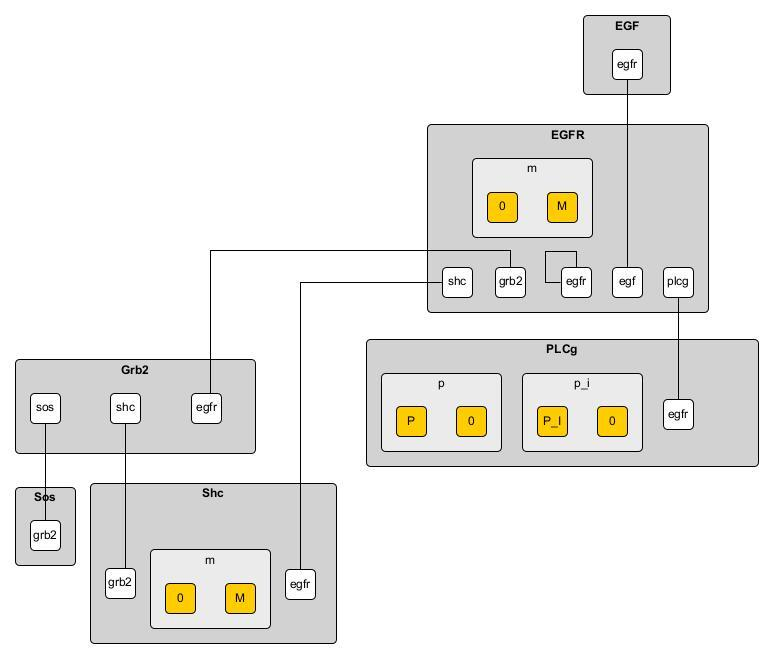
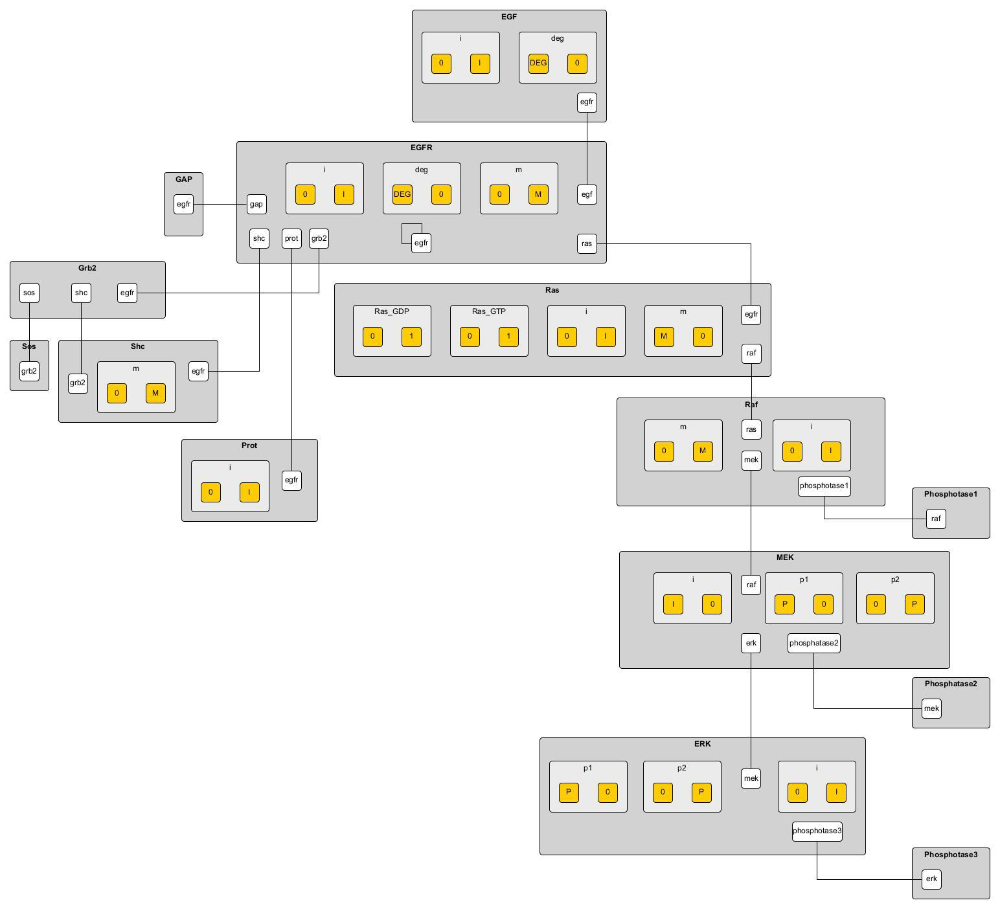

.. _atomizer:

########
Atomizer
########

Atomizer is a translator tool that can convert SBML models to BNGL models. Moreover, atomizer is 
capable of extracting implicit information found in SBML models using lexical analysis, reaction
stoichiometry and annotation information. Using this information, atomizer converts SBML species
to structured BNGL complexes. 

This in turn allows for easier identification of modification sites,
binding interactions while making the model easier to understand and analyze. Combined with BNGL 
visualization capabilities, atomizer also allows for easier model comparison of the same biological 
process. 

Getting Started
===============

Make sure you have PyBioNetGen properly installed by running

.. code-block:: shell

    bionetgen -h

If this command doesn't print out help information, install PyBioNetGen with

.. code-block:: shell

    pip install bionetgen

Basics of atomizing a model
===========================

Use the :code:`atomize` method to convert a SBML model to BNGL directly (flat translation)

.. code-block:: shell

    bionetgen atomize -i mymodel.xml -o mymodel_flat.bngl

Using the `-a` option allows for atomization of the model (atomized translation)

.. code-block:: shell

    bionetgen atomize -i mymodel.xml -o mymodel_flat.bngl -a

if the atomization is taking a long time, try the `-mr` option (please note that this might use up a lot of memory)

.. code-block:: shell

    bionetgen atomize -i mymodel.xml -o mymodel_flat.bngl -a -mr

If you encounter atomization errors, you can fix it by using a user input JSON file which is given by the `-u` option (see below)

.. code-block:: shell

    bionetgen atomize -i mymodel.xml -o mymodel_flat.bngl -a -u user_input.json

Atomizer looks up annotation information on various online resources (namely `Pathway Commons <https://www.pathwaycommons.org/>`_, `BioGRID <https://thebiogrid.org/>`_ and `UniProt <https://www.uniprot.org/>`_).
This generally allows for easier atomization, reducing user input required. If you don't have internet connection you can turn this off with the `-p` option

.. code-block:: shell

    bionetgen atomize -i mymodel.xml -o mymodel_flat.bngl -a -p

Generally a complex model will require several options with a bit of user input in JSON format (see below), for example

.. code-block:: shell

    bionetgen atomize -i mymodel.xml -o mymodel_flat.bngl -a -u user_input.json

If the atomizer output is too cluttered you can adjust the output levels with the `-ll` option

.. code-block:: shell

    bionetgen atomize -i mymodel.xml -o mymodel_flat.bngl -a -u user_input.json -ll "ERROR"

we suggest using "ERROR" or "WARNING" for `-ll` argument. 

User input format
=================

The user input JSON file has 4 potential fields. Empty fields can be omitted. 

.. code-block:: json
    
    {
        "reactionDefinition" : [
        ],
        "partialComplexDefinition" : [
        ],
        "binding_interactions" : [
            ["Partner1", "Partner2"]
        ],
        "modificationDefinition": {
            "complex":["molecule1", "molecule2"],
        }
    }

"binding_interactions" field is an array where each element is also an array of two items. 
Both items should be the names of species in the model, exactly as written in the SBML. This represents
that there is a binding interaction between the two items which in turn tells atomizer that there 
should be a binding component on both molecules for each other. 

"modificationDefinition" field is a dictionary where the key is a complex in the model and the value
is an array that reflects what the complex is comprised of. 

"reactionDefinition" field is... 

"partialComplexDefinition" field is...

Examples of atomization
=======================

These tutorials shows how to use Atomization tool to make a BNGL Model from SBML format. We will Use
various curated models from the `biomodels database <https://www.ebi.ac.uk/biomodels/search?domain=biomodels&query=*%3A*+AND+curationstatus%3A%22Manually+curated%22&numResults=10>`_. 
You can download the specific SBML files by clicking on the titles.

`Biomodels database model 48 <https://www.ebi.ac.uk/biomodels/BIOMD0000000048>`_
---------------------------------------------------------------------------------
​
**Atomizing the Model:** Once you download the SBML file of BMD48, you will have an :code:`.xml` 
file in your directory. Use it as the input to the `atomize` subcommand as shown below. To show the 
effect of using the web services we'll also add the `-p` option to not use the web serices at first

.. code-block:: shell

    bionetgen atomize -i BIOMD0000000048.xml -o BMD48.bngl -a -p

you can name the `bngl` output file whatever you want. This will print out information on the atomization
process. If the output is too cluttered you can look at only the major errors using the following command

.. code-block:: shell

    bionetgen atomize -i BIOMD0000000048.xml -o BMD48.bngl -a -p -ll "ERROR"
     
which prints out 

.. code-block:: shell

    ERROR:SCT212:['EGF_EGFR2']:EGF_EGFR2_P:Atomizer needs user information to determine which element is being modified among component species:['EGF', 'EGF', 'EGFR', 'EGFR']:_p
    ERROR:ATO202:['EGF_EGFR2', 'EGF_EGFR2_PLCg_P']:(('EGF', 'EGF'), ('EGF', 'EGFR'), ('EGFR', 'EGFR')):We need information to resolve the bond structure of these complexes . Please choose among the possible binding candidates that had the most observed frequency in the reaction network or provide a new one
    ERROR:ATO202:['EGF_EGFR2_Shc_Grb2_SOS']:(('EGF', 'Grb2'), ('EGF', 'SOS'), ('EGF', 'Shc'), ('EGFR', 'Grb2'), ('EGFR', 'SOS'), ('EGFR', 'Shc')):We need information to resolve the bond structure of these complexes . Please choose among the possible binding candidates that had the most observed frequency in the reaction network or provide a new one
    Structured molecule type ratio: 0.7

the first three "ERROR"s tells us that atomizer needs user input to resolve certain ambiguities 
in the model. Structured molecule type ratio is the ratio of structured species in the `molecule types`
block of the resulting BNGL to the total number of molecule types, to give an idea of how successful
atomizer was at inferring structure of the species in the model. 

Before we give atomizer more user input, let's try removing the `-p` option to see if atomizer can 
resolve these automatically

.. code-block:: shell

    bionetgen atomize -i BIOMD0000000048.xml -o BMD48.bngl -a -ll "ERROR"

which prints out

.. code-block:: shell

    ERROR:SCT212:['EGF_EGFR2']:EGF_EGFR2_P:Atomizer needs user information to determine which element is being modified among component species:['EGF', 'EGF', 'EGFR', 'EGFR']:_p
    ERROR:ATO202:['EGF_EGFR2_PLCg_P']:(('EGF', 'PLCg'), ('EGFR', 'PLCg')):We need information to resolve the bond structure of these complexes . Please choose among the possible binding candidates that had the most observed frequency in the reaction network or provide a new one
    Structured molecule type ratio: 0.875
 
there were multiple instances of "ERROR:MSC02" that warn the user about issues with connections
to the `BioGRID <https://thebiogrid.org/>`_ service which were removed for clarity. Now we only
have two errors left. 

Resolving errors
================

Now let's take a look at the remaining issues one by one

.. code-block:: shell

    ERROR:SCT212:['EGF_EGFR2']:EGF_EGFR2_P:Atomizer needs user information to determine which element is being modified among component species:['EGF', 'EGF', 'EGFR', 'EGFR']:_p

atomizer is having trouble figuring out where the modification `_p` is supposed to go, which is a 
phosphorylation site. We know that EGFR is the molecule that's being phosphorylated so we make a 
JSON file (here we call it `user-input_1.json`)

.. code-block:: json

  {
	"modificationDefinition": {
		"EGF_EGFR2_P": ["EGFR_P", "EGFR", "Epidermal_Growth_Factor", "Epidermal_Growth_Factor"]
	}
  }

and we rerun atomization with the `-u` option using this JSON file we created

.. code-block:: shell

    bionetgen atomize -i BIOMD0000000048.xml -o BMD48.bngl -a -ll "ERROR" -u user-input-1.json

which returns (disregarding connection errors)

.. code-block:: shell
    
    ERROR:ATO202:['EGF_EGFR2_PLCg', 'EGF_EGFR2_PLCg_P']:(('EGFR', 'PLCg'), ('Epidermal_Growth_Factor', 'PLCg')):We need information to resolve the bond structure of these complexes . Please choose among the possible binding candidates that had the most observed frequency in the reaction network or provide a new one

which tells us that atomizer can't resolve where `PLCg` is binding, let's add that to the JSON file

.. code-block:: json

  {
    "binding_interactions": [
        ["EGFR", "PLCg"]
    ],
	"modificationDefinition": {
		"EGF_EGFR2_P": ["EGFR_P", "EGFR", "Epidermal_Growth_Factor", "Epidermal_Growth_Factor"]
	}
  }

rerunning atomizer should return no errors and you should now have a fully atomized BNGL model.
:ref:`usage`
and using yEd to look at the contact map gives us the following 

`Biomodels database model 19 <https://www.ebi.ac.uk/biomodels/BIOMD0000000019>`_
---------------------------------------------------------------------------------

This model is an expanded version of BioModel 48. Let's follow the same strategy and atomize
it without any input first and see what atomizer says. 

.. code-block:: shell

    bionetgen atomize -i BIOMD0000000019.xml -o BMD19.bngl -a -ll "ERROR"

this returns

.. code-block:: shell

    ERROR:ATO202:['EGF_EGFRm2_GAP_Grb2_Prot', 'EGF_EGFRm2_GAP_Grb2_Sos_Prot', 
                  'EGF_EGFRm2_GAP_Shcm_Grb2_Prot', 'EGF_EGFRm2_GAP_Grb2_Sos_Ras_GTP_Prot', 
                  'EGF_EGFRm2_GAP_Shcm_Grb2_Sos_Prot', 'EGF_EGFRm2_GAP_Grb2_Sos_Ras_GDP_Prot', 
                  'EGF_EGFRm2_GAP_Shcm_Grb2_Sos_Ras_GTP_Prot', 
                  'EGF_EGFRm2_GAP_Shcm_Grb2_Sos_Ras_GDP_Prot']:
                  (('EGF', 'Prot'), ('EGFR', 'Prot'), ('GAP', 'Prot'), 
                  ('Grb2', 'Prot')):We need information to resolve the bond structure of these 
                  complexes . Please choose among the possible binding candidates that had the 
                  most observed frequency in the reaction network or provide a new one
    Structured molecule type ratio: 0.6363636363636364

which tells us that atomizer is having trouble figuring out which binding interaction to include
for `Prot`. We know that protein binds to EGFR so let's include that in a user input JSON file

.. code-block:: json

    {
        "binding_interactions": [
            ["EGFR", "Prot"]
        ]
    }

and now rerunning the atomization using this user input file

.. code-block:: shell

    bionetgen atomize -i BIOMD0000000019.xml -o BMD19.bngl -a -ll "ERROR" -u user-input-1.json

now returns no errors. However, looking at the resuling BNGL shows `Ras_GTP(Ras_GDP~0~1,egfr,i~0~I,m~0~M,raf)`
and we know that Ras should be the base species. We can include that using the `modificationDefinition`
section in the user input file

.. code-block:: json

    {
        "binding_interactions": [
            ["EGFR", "Prot"]
        ],
        "modificationDefinition": {
            "Ras": [],
            "Ras_GTP": ["Ras"],
            "Ras_GDP": ["Ras"]
        }
    }

rerunning atomization using this user input gives a fully atomized BNGL file. 
:ref:`usage`
and using yEd to look at the contact map gives us the following 

`Biomodels database model 151 <https://www.ebi.ac.uk/biomodels/BIOMD0000000151>`_
---------------------------------------------------------------------------------

Running atomizer on this model with the following

.. code-block:: shell

    bionetgen atomize -i bmd0000000151.xml -o bmd151.bngl -a -ll "ERROR" 

we get the following errors

.. code-block:: shell

    ERROR:ANN202:Ras_GTP:Rafast:can be mapped through naming conventions but the annotation information does not match        
    ERROR:ANN202:Ras_GDP:Rafast:can be mapped through naming conventions but the annotation information does not match        
    ERROR:SCT211:IL6_gp80_gp130_JAKast2_STAT3C_SOCS3_SHP2:[['IL6_gp80', 'IL6_gp80', 'gp130_JAK_ast', 'gp130_JAK', 'SHP2', 'SOC
        S3', 'STAT3C'], ['IL6_gp80_gp130_JAKast2_STAT3C_SHP2', 'SOCS3']]:[['IL6_gp80', 'IL6_gp80', 'JAK', 'JAK', 'SHP2', 'SOCS3', 
        'STAT3'], ['IL6_gp80', 'SOCS3']]:Cannot converge to solution, conflicting definitions                                     
    ERROR:SCT211:IL6_gp80_gp130_JAKast2_SHP2ast_Grb2_SOS_Ras_GDP:[['Grb2', 'IL6_gp80', 'IL6_gp80', 'gp130_JAK_ast', 'gp130_JAK
        ', 'Ras_GDP', 'SHP2ast', 'SOS'], ['Grb2', 'IL6_gp80', 'IL6_gp80', 'gp130_JAK_ast', 'gp130_JAK', 'Ras_GTP', 'SHP2ast', 'SOS
        ']]:[['Grb2', 'IL6_gp80', 'IL6_gp80', 'JAK', 'JAK', 'Ras_GDP', 'SHP2', 'SOS'], ['Grb2', 'IL6_gp80', 'IL6_gp80', 'JAK', 'JA
        K', 'Ras_GTP', 'SHP2', 'SOS']]:Cannot converge to solution, conflicting definitions
    ERROR:SCT211:IL6_gp80_gp130_JAKast2_SHP2ast_Grb2_SOS_Ras_GTP:[['Grb2', 'IL6_gp80', 'IL6_gp80', 'gp130_JAK_ast', 'gp130_JAK
        ', 'Ras_GDP', 'SHP2ast', 'SOS'], ['Grb2', 'IL6_gp80', 'IL6_gp80', 'gp130_JAK_ast', 'gp130_JAK', 'Ras_GTPast', 'SHP2ast', '
        SOS']]:[['Grb2', 'IL6_gp80', 'IL6_gp80', 'JAK', 'JAK', 'Ras_GDP', 'SHP2', 'SOS'], ['Grb2', 'IL6_gp80', 'IL6_gp80', 'JAK',
        'JAK', 'Ras_GTP', 'SHP2', 'SOS']]:Cannot converge to solution, conflicting definitions
    ERROR:ATO202:['IL6_gp80_gp130_JAK2', 'IL6_gp80_gp130_JAK_ast2', 'IL6_gp80_gp130_JAKast2_JAK', 'IL6_gp80_gp130_JAKast2_SOCS
        3', 'IL6_gp80_gp130_JAKast2_STAT3C', 'IL6_gp80_gp130_JAKast2_SHP2ast', 'IL6_gp80_gp130_JAKast2_STAT3Cast', 'IL6_gp80_gp130
        _JAKast2_SHP2ast_Grb2', 'IL6_gp80_gp130_JAKast2_STAT3C_SOCS3', 'IL6_gp80_gp130_JAKast2_SHP2_Grb2']:(('IL6_gp80', 'IL6_gp80
        '), ('IL6_gp80', 'JAK'), ('JAK', 'JAK')):We need information to resolve the bond structure of these complexes . Please cho
        ose among the possible binding candidates that had the most observed frequency in the reaction network or provide a new one

first two errors show that atomizer is having problems identifying `Ras_GTP`, `Ras_GDP` as `Ras`. We can tell atomizer
the basic building blocks for the atomization in the `modificationDefinition` block

.. code-block:: json

    "modificationDefinition": {
        "Ras": [],
        "Ras_GTP": ["Ras"],
        "Ras_GDP": ["Ras"]
    }

looking at the other errors we can tall atomizer also is having trouble identifing the binding between `IL6` and `gp80`
since it's asking about binding interactions between `IL6_gp80` and other items, let's fix that too

.. code-block:: json

    {
        "modificationDefinition": {
        "Ras": [],
        "Ras_GTP": ["Ras"],
        "Ras_GDP": ["Ras"],
        "IL6_gp80": ["IL6", "gp80"]
        }
    }

Rerunning atomizer with this user input using the following 

.. code-block:: shell

    bionetgen atomize -i bmd0000000151.xml -o bmd151.bngl -a -ll "ERROR" -u user_input_151.json

gives the following new set of errors

.. code-block:: shell

    ERROR:ATO202:['IL6_gp80_gp130_JAK', 'IL6_gp80_gp130_JAK2', 'IL6_gp80_gp130_JAK_ast2']:
        (('IL6', 'JAK'), ('JAK', 'gp80')):We need information to resolve the bond structure 
        of these complexes . Please choose among the possible binding candidates that had the 
        most observed frequency in the reaction network or provide a new one
    ERROR:ATO202:['IL6_gp80_gp130_JAKast2_JAK', 'IL6_gp80_gp130_JAKast2_SHP2ast', 
        'IL6_gp80_gp130_JAKast2_STAT3C_SHP2', 'IL6_gp80_gp130_JAKast2_SHP2ast_Grb2', 
        'IL6_gp80_gp130_JAKast2_SHP2_Grb2', 'IL6_gp80_gp130_JAKast2_STAT3C_SOCS3_SHP2', 
        'IL6_gp80_gp130_JAKast2_SHP2ast_Grb2_SOS_Ras_GDP', 
        'IL6_gp80_gp130_JAKast2_SHP2ast_Grb2_SOS_Ras_GTP']:
        (('IL6', 'SHP2'), ('SHP2', 'gp80')):We need information to resolve the bond structure 
        of these complexes . Please choose among the possible binding candidates that had the 
        most observed frequency in the reaction network or provide a new one
    ERROR:ATO202:['IL6_gp80_gp130_JAKast2_SOCS3', 'IL6_gp80_gp130_JAKast2_STAT3C_SOCS3']:
        (('IL6', 'SOCS3'), ('SOCS3', 'gp80')):We need information to resolve the bond structure of 
        these complexes . Please choose among the possible binding candidates that had the most 
        observed frequency in the reaction network or provide a new one
    ERROR:ATO202:['IL6_gp80_gp130_JAKast2_STAT3C']:(('IL6', 'STAT3C'), ('STAT3C', 'gp80')):
        We need information to resolve the bond structure of these complexes . Please choose among 
        the possible binding candidates that had the most observed frequency in the reaction network 
        or provide a new one
    ERROR:ATO202:['IL6_gp80_gp130_JAKast2_STAT3Cast']:(('IL6', 'STAT3Cast'), ('STAT3Cast', 'gp80')):
        We need information to resolve the bond structure of these complexes . Please choose among 
        the possible binding candidates that had the most observed frequency in the reaction network 
        or provide a new one

unfortunately, we know from the model that these are not the correct binding interactions. `JAK` binds 
to `gp130` and so does `SHP2`. Let's add those in

.. code-block:: json

    {
        "binding_interactions": [
            ["gp130", "SHP2"],
            ["gp130", "JAK"]
        ],
        "modificationDefinition": {
        "Ras": [],
        "Ras_GTP": ["Ras"],
        "Ras_GDP": ["Ras"],
        "IL6_gp80": ["IL6", "gp80"]
        }
    }

which gives

.. code-block:: shell

    ERROR:SCT241:IL6_gp80_gp130_JAKast2_SHP2ast_Grb2_SOS_Ras_GDP:
        IL6_gp80_gp130_JAKast2_SHP2ast_Grb2_SOS_Ras_GTP:produce the same translation:
        ['Grb2', 'IL6', 'IL6', 'JAK', 'JAK_ast', 'Ras_GDP', 'SHP2ast', 'SOS', 'gp130', 'gp130', 
        'gp80', 'gp80']:IL6_gp80_gp130_JAKast2_SHP2ast_Grb2_SOS_Ras_GTP:was emptied 

We can tell atomizer the composition of `IL6_gp80_gp130_JAKast2_SHP2ast_Grb2_SOS_Ras_GTP` with 

.. code-block:: json

    {
        "binding_interactions": [
            ["gp130", "SHP2"],
            ["gp130", "JAK"]
        ],
        "modificationDefinition": {
        "Ras": [],
        "Ras_GTP": ["Ras"],
        "Ras_GDP": ["Ras"],
        "IL6_gp80": ["IL6", "gp80"],
        "IL6_gp80_gp130_JAKast2_SHP2ast_Grb2_SOS_Ras_GTP": ["IL6","gp80","gp130","JAK","IL6","gp80","gp130","JAK","SHP2","Grb2","SOS","Ras"]
        }
    }

which atomizer without errors. Looking at BNGL, we can see that atomizer misses the interaction
between SOS and Ras and instead binds SOS to Grb2, we can fix that with this final JSON addition

.. code-block:: json

    {
        "binding_interactions": [
            ["gp80", "gp80"],
            ["gp130", "SHP2"],
            ["SOS", "Ras"]
        ],
        "modificationDefinition": {
        "Ras": [],
        "Ras_GTP": ["Ras"],
        "Ras_GDP": ["Ras"],
        "IL6_gp80": ["IL6", "gp80"],
        "IL6_gp80_gp130_JAKast2_SHP2ast_Grb2_SOS_Ras_GTP": ["IL6","gp80","gp130","JAK","IL6","gp80","gp130","JAK","SHP2","Grb2","SOS","Ras"]
        }
    }

which gives us a fully atomized model. 

`Biomodels database model 543 <https://www.ebi.ac.uk/biomodels/BIOMD0000000543>`_
---------------------------------------------------------------------------------

Model 543 is an expanded version of model 151, please look at BMD151 tutorial before starting here.
We will start from a subset of the the final user input JSON file we constructed for BMD151.

.. code-block:: json
    {
        "binding_interactions": [
            ["gp80", "gp80"],
            ["gp130", "SHP2"],
            ["SOS", "Ras"]
        ],
        "modificationDefinition": {
        "Ras": [],
        "Ras_GTP": ["Ras"],
        "Ras_GDP": ["Ras"]
        }
    }

We can then use the following command to start atomizing with this user input file (which we named `user_input_543`)

.. code-block:: shell

    bionetgen atomize -i bmd0000000543.xml -o bmd543.bngl -a -ll "ERROR" -u user_input_543.json

which gives us the following set of errors and a reasonably well atomized model

.. code-block:: shell

    ERROR:ATO202:['IFN_R_JAK2m_SHP2']:(('IFN', 'SHP2'), ('JAK', 'SHP2'), ('R', 'SHP2')):
        We need information to resolve the bond structure of these complexes . 
        Please choose among the possible binding candidates that had the most observed 
        frequency in the reaction network or provide a new one
    ERROR:ATO202:['IFN_R_JAK2m_STAT3C']:(('IFN', 'STAT3C'), ('JAK', 'STAT3C'), ('R', 'STAT3C')):
        We need information to resolve the bond structure of these complexes . Please choose among 
        the possible binding candidates that had the most observed frequency in the reaction network 
        or provide a new one
    ERROR:ATO202:['IFN_R_JAK2m_STAT3Cm']:(('IFN', 'STAT3Cm'), ('JAK', 'STAT3Cm'), ('R', 'STAT3Cm')):
        We need information to resolve the bond structure of these complexes . 
        Please choose among the possible binding candidates that had the most observed frequency 
        in the reaction network or provide a new one
    ERROR:SCT241:IL6_gp80_gp130_JAK2m_STAT1:IL6_gp80_gp130_JAK2m_STAT1C:produce the same translation:
        ['IL6', 'IL6', 'JAKIL_6', 'JAKIL_6', 'STAT1C', 'gp130', 'gp130m', 'gp80', 'gp80']:
        IL6_gp80_gp130_JAK2m_STAT1C:was emptied
    ERROR:SCT241:IFN_R_JAK:IFN_R_JAK2:produce the same translation:['IFN', 'JAK', 'R']:
        IFN_R_JAK2:was emptied

for the first two errors, we add binding interactions ["R", "SHP2"] and ["R", "STAT3"]. The third error
we notice that atomizer thinks `STAT3C` and `STAT3` are different, we'll address that by adding `modificationDefinition`shell
for STAT species and get the following input file

.. code-block:: json

    {
        "binding_interactions": [
            ["gp80", "gp80"],
            ["gp130", "SHP2"],
            ["SOS", "Ras"],
            ["R","SHP2"],
            ["R","STAT3"]
        ],
        "modificationDefinition": {
        "Ras": [],
        "Ras_GTP": ["Ras"],
        "Ras_GDP": ["Ras"],
        "STAT3": [],
        "STAT3m": ["STAT3"],
        "STAT3C": ["STAT3"],
        "STAT3Cm": ["STAT3"],
        "STAT1": [],
        "STAT1m": ["STAT1"],
        "STAT1C": ["STAT1"],
        "STAT1Cm": ["STAT1"]
        }
    }

atomizing again we get the following errors

.. code-block:: shell

    ERROR:ANN202:SOCS1:SOCS3:can be mapped through naming conventions but the annotation information 
        does not match
    ERROR:ANN202:Phosp1:Phosp3:can be mapped through naming conventions but the annotation information 
        does not match
    ERROR:SCT241:IFN_R_JAK:IFN_R_JAK2:produce the same translation:['IFN', 'JAK', 'R']:IFN_R_JAK2:
        was emptied
    ERROR:SCT241:IL6_gp80_gp130_JAK2m_STAT1:IL6_gp80_gp130_JAK2m_STAT1C:produce the same translation:
        ['IL6', 'IL6', 'JAKIL_6', 'JAKIL_6', 'STAT1C', 'gp130', 'gp130m', 'gp80', 'gp80']:
        IL6_gp80_gp130_JAK2m_STAT1C:was emptied

looking at the 3rd and 4th errors, combined with the previous errors, we can see that atomizer is having
trouble resolving types of JAK molecules. We can add `modificationDefinition`s to help with those and 
some downstream products of JAK

.. code-block:: json​

    "JAK": [],
    "JAKIFN": ["JAK"],
    "JAKIL_6":["JAK"]
    "R_JAK": ["R","JAKIFN"],
    "IFN_R_JAK": ["IFN","R_JAK"],
    "IFN_R_JAK2": ["IFN_R_JAK", "IFN_R_JAK"],
    "IFN_R_JAK2m": ["IFN_R_JAK2"],
    "gp130_JAK": ["gp130", "JAKIL_6"]
​
adding these to the user input file and rerunning atomization gives

.. code-block:: shell

    ERROR:ANN202:SOCS1:SOCS3:can be mapped through naming conventions but the annotation information 
        does not match
    ERROR:ANN202:Phosp1:Phosp3:can be mapped through naming conventions but the annotation information 
        does not match
    ERROR:SCT241:IL6_gp80_gp130_JAK2m_STAT1:IL6_gp80_gp130_JAK2m_STAT1C:produce the same translation:
        ['IL6', 'IL6', 'JAKIL_6', 'JAKIL_6m', 'STAT1C', 'gp130', 'gp130', 'gp80', 'gp80']:
        IL6_gp80_gp130_JAK2m_STAT1C:was emptied

looking at the last error, we should give a `modificationDefinition` for `IL6_gp80_gp130_JAK2m_STAT1C`

.. code-block:: shell

    "IL6_gp80_gp130_JAK2m_STAT1C": ["IL6", "gp80", "gp130", "JAK","IL6", "gp80", "gp130", "JAK","STAT1"]

Adding this will result in atomization without any errors. However, looking at BMD543, we find some 
`binding_interactions` that should be added to BMD543 user input that are missing in BMD151. We add
the following set of `binding_interactions`

.. code-block:: json

    ["gp130", "SOCS3"], 
    ["gp130","STAT3"]
    ["R","STAT1"], 
    ["R","R"],
    ["R","SOCS1"],
    ["STAT1","gp130"]

to get the final input file 

.. code-block:: json

    {
        "binding_interactions": [
            ["gp80", "gp80"],
            ["SOS", "Ras"],
            ["R","SHP2"],
            ["R","STAT3"],
            ["R","STAT1"],
            ["R","R"],
            ["R","SOCS1"],
            ["gp130", "SHP2"],
            ["STAT1","gp130"],
            ["STAT3","gp130"],
            ["gp130", "SOCS3"]
        ],
        "modificationDefinition": {
        "Ras": [],
        "Ras_GTP": ["Ras"],
        "Ras_GDP": ["Ras"],
        "STAT3": [],
        "STAT3m": ["STAT3"],
        "STAT3C": ["STAT3"],
        "STAT3Cm": ["STAT3"],
        "STAT1": [],
        "STAT1m": ["STAT1"],
        "STAT1C": ["STAT1"],
        "STAT1Cm": ["STAT1"],
        "JAK": [],
        "JAKIFN": ["JAK"],
        "JAKIL_6":["JAK"],
        "R_JAK": ["R","JAKIFN"],
        "gp130_JAK": ["gp130", "JAKIL_6"],
        "IFN_R_JAK2": ["IFN","R_JAK", "IFN","R_JAK"],
        "IFN_R_JAK2m": ["IFN_R_JAK2"],
        "IL6_gp80_gp130_JAK2m_STAT1C": ["IL6", "gp80", "gp130", "JAK","IL6", "gp80", "gp130", "JAK","STAT1"]
        }
    }

and running with this user input file gives us the fully atomized model.