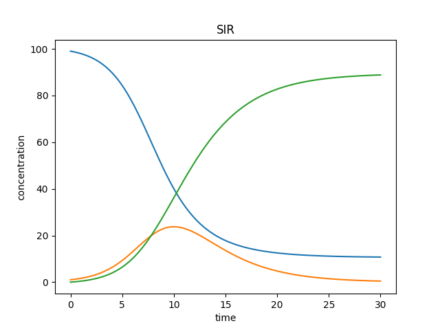
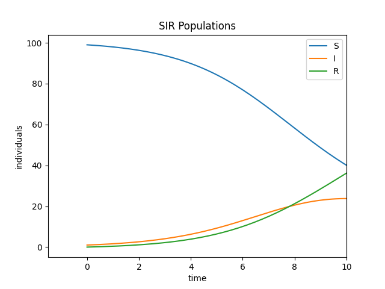

.. _cli_tut:

############
CLI Tutorial
############

This tutorial shows how to use PyBioNetGen's command line interface to run and plot a simple BNGL model,
as well as how to create a simple Jupyter notebook containing the model, using the simple "SIR.bngl"
model as an example.

Getting Started
===============

Make sure you have PyBioNetGen properly installed by running

.. code-block:: shell

    bionetgen -h

If this command doesn't print out help information, install PyBioNetGen with

.. code-block:: shell

    pip install bionetgen

Running a Model
===============

To first run your model in a new or existing folder called "SIR_folder", use the :code:`run` subcommand:

.. code-block:: shell

    bionetgen run -i SIR.bngl -o SIR_folder

This will run the model and save the results under the specified folder,
allowing for further analysis.

Plotting a Model
================

To simply plot the gdat or cdat file, use the :code:`plot` subcommand with the appropriate file:

.. code-block:: shell

    bionetgen plot -i SIR.gdat

The resulting gdat plot should look like this:

However, there are many optional arguments, such as including a legend or changing axes. Use :code:`bionetgen plot -h` to see them.
For example, if we wanted to look at a smaller timeframe, change some labels, and include a legend, we would run:

.. code-block:: shell

    bionetgen plot -i SIR.gdat --legend --xmax 10 --ylabel "individuals" --title "SIR Populations"

The updated plot should look like this:

Creating a Notebook
===================

Finally, use the :code:`notebook` subcommand to create a `Jupyter notebook <https://jupyter.org/>`_:

.. code-block:: shell

    bionetgen notebook -i SIR.bngl -o SIR_notebook.ipynb

This subcommand currently has limited functionality, and will only create a simple notebook
that can run and plot the model.