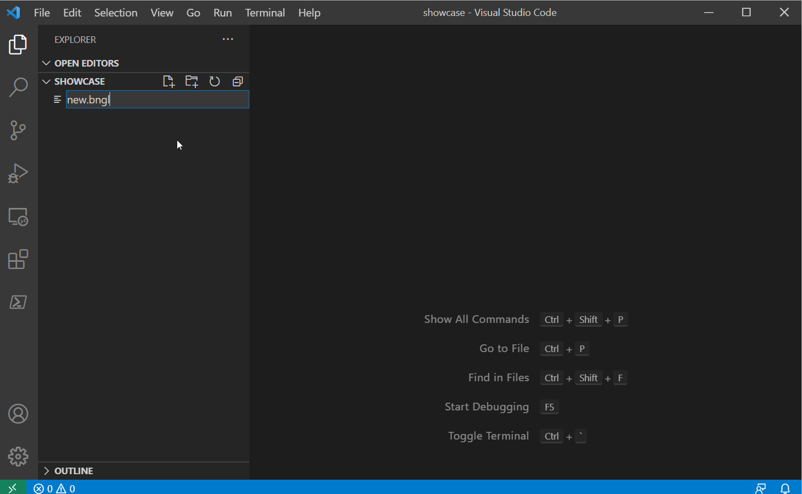
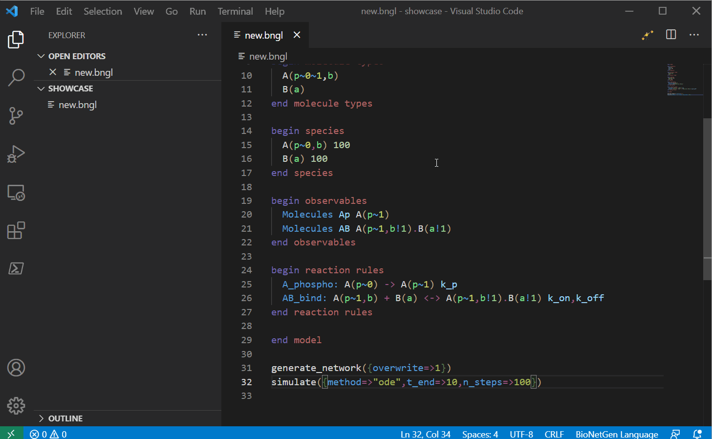
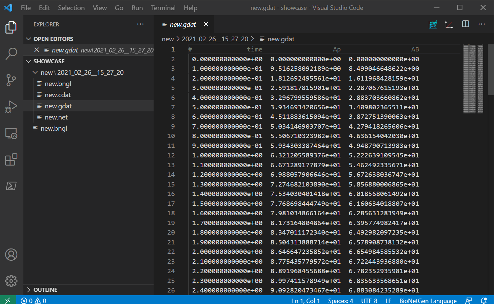
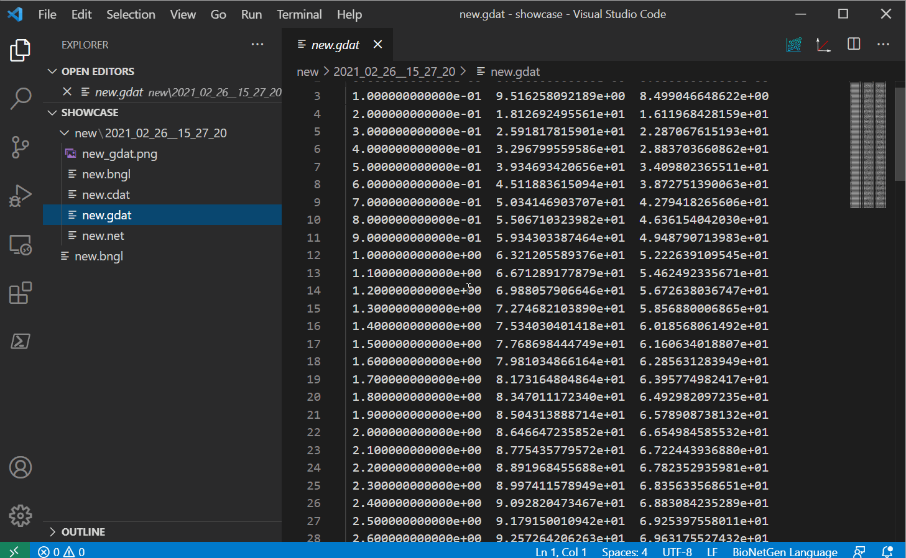
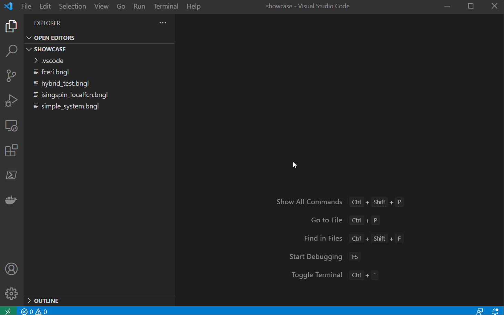

.. _vsc_usage:

#####
Usage
#####

BioNetGen modelling language is a language for writing rule-based models of biochemical systems, 
including signal transduction, metabolic, and genetic regulatory networks, see 
`here <https://bionetgen.org/>`_ for more information. 

This VS Code extension is designed to help write BNGL models by adding syntax highlighting and 
snippet support, do rapid tests of the model as you write with the help of a built-in run button 
and basic plotting features.

Syntax highlighting and snippets
================================

Once the extension is installed you can create a new file with ``.bngl``. This file extension 
will be automatically detected and you should see a run button at the top right corner of the 
file if the extension is running correctly. This extension will also do syntax highlighing on 
files with ``.net`` extension. 

Next you can start writing your model. This VS Code extension supports a large list of snippets 
that can help you write your model. For a full list, see 
`here <https://github.com/RuleWorld/BNG_vscode_extension/blob/main/snippets/bngl-snippets.json>`_, 
we will update this with a snippet guide in the future. 

Using the correct theme
=======================

If you notice that there is no highlighting on certain parts of the model or if the colors don't 
match with the figures presented here, please make sure you have the ``dark-bngl`` theme 
activated (see 
`here <https://code.visualstudio.com/docs/getstarted/themes#_selecting-the-color-theme>`_ to learn 
how to select color themes). Currently only a dark theme is supported, we will include a light 
version in the future. 

Running a model
===============

Important note: for the extension to know where to write the results, you MUST open a folder 
with VS Code. The extension will use the folder selected as the place to put the results. 
This will change in future releases (current version: 0.5.9)

Once you finished writing the model, you can try running it. For the run button to work, the 
default terminal window VS Code opens should have access to `Perl <https://www.perl.org/>`_, 
`Python3 <https://www.python.org/>`_ (preferably 
`anaconda python <https://docs.anaconda.com/anaconda/>`_) and the 
`PyBioNetGen library <https://pypi.org/project/bionetgen/>`_. See 
:ref:`install` for more instructions on how to install the 
library. You can test if you have the library correctly installed by 
`opening a new terminal <https://code.visualstudio.com/docs/editor/integrated-terminal#_terminal-keybindings>`_ 
and running ``bionetgen -h``. 

Once you press the run button (or use the shortcut ``CTRL/CMD+SHIFT+F1``), the extension should 
create a new folder with the same name as the model. A time stamped folder will also be created 
and the current model will be copied under there and the extension will use the terminal and the 
`PyBioNetGen library <https://pypi.org/project/bionetgen/>`_ to run the model. Once the run 
completes, if the run created a ``.gdat`` file, it should open automatically.

Plotting results
================

Once you have some ``gdat/cdat/scan`` files to look at, you can open one and you should see two 
new buttons instead of the run button. The white and red button on the right should plot your 
file into a png with some basic defaults (options to change these options will be provided in 
future releases).

The blue button on the left should open a new window with an interactive plot (thanks to 
`plotly.js <https://plotly.com/javascript/>`_). You can also use the ``CTRL/CMD+SHIFT+F1`` 
shortcut. The plotly window also allows you to save the image as a png as well as a svg file and 
has `interactive features <https://plotly.com/javascript/>`_. You can also change the plotting type 
to markers or lines+markers and use one of the selection tools to sub-select time series. If you 
select a region on the plot with no data points, every time series in the original dataset will 
be shown again.

Visualization
=============

You can also click on the visualize button that can be found to the left of the run button. 
This will generate all possible visualizations that's available to BioNetGen in a separate folder as GraphML files. 
These files are designed to be used in conjunction with `yEd <https://www.yworks.com/products/yed>`_. 
If you have yEd installed, you can associate yEd with GraphML files in your OS 
(`example for windows 10 <https://support.microsoft.com/en-us/windows/change-default-programs-in-windows-10-e5d82cad-17d1-c53b-3505-f10a32e1894d>`_). 
If you also install the `open in external app extension for VS Code <https://marketplace.visualstudio.com/items?itemName=YuTengjing.open-in-external-app>`_
you can right click the GraphML files and click on `Open in external App` to open the graph in yEd.

